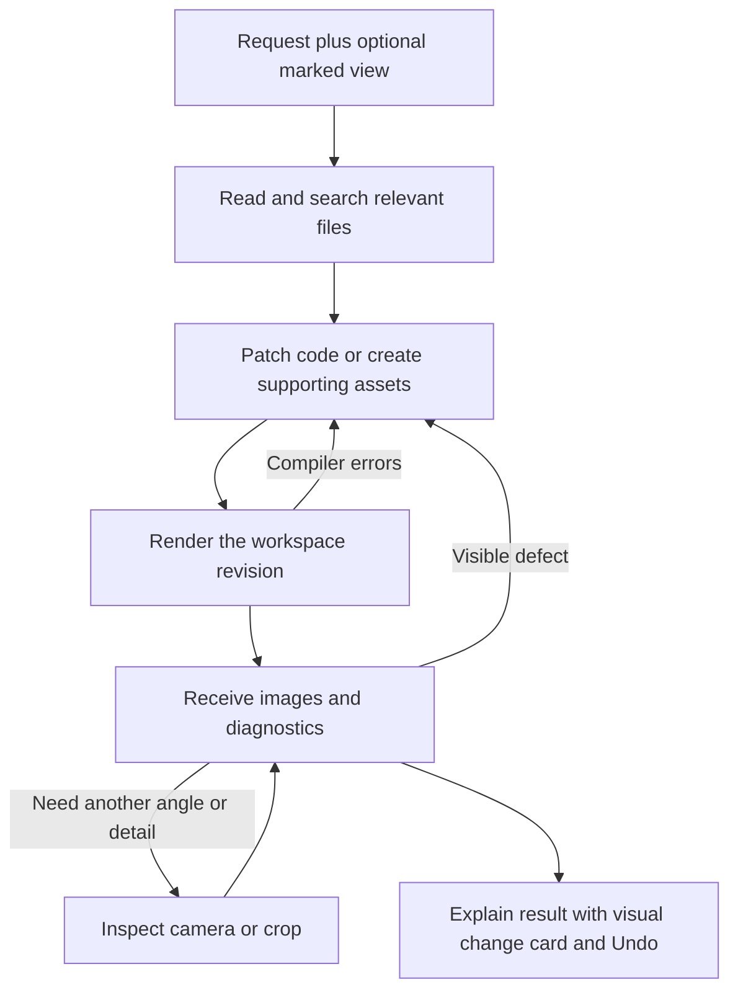

# Plan 002: Give the studio a coding-agent workspace and a visual feedback loop

> Revised 2026-09-06 after the user rejected parameter-control product direction.
> This replaces the previous plan in full. The project must remain arbitrarily
> extensible through source code and supporting files. No parameter panels,
> parameter extraction, geometry DSL, or catalog of allowed design operations.
>
> Subsequent user direction supersedes this plan's custom agent/tool implementation
> sequence: use the existing Codex harness plus skills, with the app owning input
> and output. A [standalone working prototype](../prototype/README.md) has now been
> implemented and verified with real Codex turns. Treat the milestones below as
> earlier investigation, not authorization to rebuild the harness. Integration into
> the existing Next.js product remains separate work.

## Status and drift

- Priority P1; effort L across several milestones; risk MED, primarily state/continuation.
- Planned at `bc11fe1`, using the working tree on 2026-09-06.
- Depends on the studio/canonical implementation already present. Plan 001's index
  status has not been reconciled by this investigation.
- Run `git diff --stat bc11fe1..HEAD -- src plans` and `git diff --stat -- src`
  before implementation. Compare relevant live code against the anchors below.
- Preserve existing uncommitted README, queries, builtin canonical source/tests/assets,
  and agent instruction files. HEAD does not capture all investigated files.
- Earlier investigation ran `npm test`: 3 files / 8 tests passed; and
  `npx tsc --noEmit --incremental false`: passed. No application code changed since
  those checks during planning. No lint script exists. AI calls, render performance,
  SDK integration, and slicer behavior have not been benchmarked by this investigation.

## Product intent

The human describes an outcome or marks a rendered view. The agent can investigate
and change any source or supporting text asset, render the resulting project,
inspect images/errors, and repair it. Adding an emoji, altering the bank's closure,
or inventing a different base should not require the studio developer to expose
another parameter or add a domain-specific mutation tool.

Preserve OpenSCAD as the expressive representation. Variables/modules inside the
source remain useful engineering practice, but do not turn them into the product's
interaction boundary. The work to optimize is the coding/inspection loop, not the
number of model calls in isolation.

## What coding-agent work contributes

The advisor's available tools in this session include shell-backed `rg`/file reads,
`apply_patch`, command execution with output, browser screenshots, and local image
viewing. They expose code, execution evidence, and visual evidence separately.
Opening a webpage for a human does not make its contents visible to an AI; the AI
must receive a screenshot or other observation. Likewise, code-writing success is
not compilation success, and compilation success is not visual correctness.

Apply that pattern to CAD:

| Coding work | Studio equivalent |
|---|---|
| List/search files and read relevant ranges | Inspect `input.scad`, helper `.scad`, SVGs, and project guidance |
| Apply a patch or create a file | Arbitrary multi-file code/asset edits |
| Run a build/test command and receive output | Execute OpenSCAD and receive diagnostics, bounds, and a render handle |
| Inspect a browser screenshot | View the actual mesh from selected cameras and crops |
| Fix the discovered issue | Patch code/assets and rerun the affected check |
| Review a diff/checkpoint | Review a visual change, technical diff, and Undo |
| Screenshot attached to a bug report | Marked viewport capture with revision and camera |

Useful file reads are normal agent work. The current waste is duplicate full-source
injection/read results, replay of old full programs, and mandatory full rewrites.
More tool calls can be worthwhile if they produce a correct result with fewer user
correction turns. Do not promise eliminating context growth: even good coding agents
need bounded reads, transcript projection/compaction, and artifact retrieval.

## Vetted current-state evidence

| Finding | Evidence | Impact | Effort / risk / confidence |
|---|---|---|---|
| Whole-source-only editing | `src/lib/agents/studio-agent.ts:11–13,42,49–52`; `src/lib/tools/write-openscad.ts:13–23` | A small change requires regenerating the file. Source appears in instructions and can also appear in read results/history. | M / MED / HIGH |
| Agent cannot manipulate supporting files | `studio-agent.ts:43–45`; `src/lib/openscad/render.worker.ts:180–186` | Renderer mounts auxiliary files, but agent only sees names and can edit the main program. | M / MED / HIGH |
| Execution result never reaches AI | `write-openscad.ts:18–23`; `src/lib/openscad/useRenderer.ts:115–125`; `src/components/studio/chat-panel.tsx:102–112` | Agent replies without compile errors or visual evidence. | L / MED / HIGH |
| Capture infrastructure already exists | `src/components/studio/preview.tsx:194–209`; `src/components/studio/studio.tsx:316–328` | JPEG capture exists for canonical thumbnails, but is disconnected from chat. | M / LOW / HIGH |
| No revision in RenderState | `useRenderer.ts:6–11,87–92`; `studio.tsx:103–107,153–159` | Retained meshes can be stale, including 3MF export. Vision needs the same revision protection. | M / MED / HIGH |
| Visual feedback has no entry point | `preview.tsx:216–259`; `chat-panel.tsx:64–75,121–138` | Images are supported, but users cannot capture/mark the viewport directly. | M / LOW / HIGH |

Current-state anchors:

```ts
// src/lib/tools/write-openscad.ts:18
execute: async ({ code }) => {
  source.code = code
  return {
    ok: true as const,
    lines: code.split('\n').length,
  }
},
// src/lib/openscad/render.worker.ts:182
for (const f of files) {
  fs.writeFile(`/${f.name}`, new Uint8Array(f.data))
}
fs.writeFile('/input.scad', code)
```

The existing read tool sees a request-local source box. It does not fetch manual
changes made in the browser during the running turn. New workspace tools must state
which revision they read and reject edits based on an outdated revision.

## Proposed representation: a persistent logical code workspace

Expose the existing main source as `input.scad`, backed by `projects.code`, and
existing workspace files as siblings. This is an adapter over current storage;
there must not be another independently editable copy of the main source.
Example files might be `input.scad`, `smiley.svg`, and `lettering.scad`. Projects
may remain a single file. Do not split existing programs merely to fit a template.

A compact workspace manifest supplies file names, text/binary type, sizes, hashes,
revision, entrypoint, relevant canonical guidance, and current render status.
File content is available on demand. For a small one-file project, supplying its
current source once can avoid a needless initial read; establish a size threshold
from measurements. Do not also replay older full versions. Large projects use
search/read tools with ranges, bounded results, and explicit truncation indicators.

All writes create a workspace revision covering code and supporting files together.
Use atomic expected-revision comparison plus operation IDs. Apply a multi-file patch
as one operation: either every hunk/file succeeds or nothing changes. Never fuzzy
apply an ambiguous edit. Return changed-file names, a compact diff summary, and the
new revision, not another full copy of every file. Full-file creation/replacement
remains available when it is the natural operation.

Maintain undoable snapshots/checkpoints of code and corresponding file content
(reuse existing snapshot conventions; no mesh buffers in each revision). Undo
restores both code and assets by creating a new revision. Code editor saves and
manual file imports/removals use the same mutation boundary. Flush manual debounce
changes before a new turn; reject stale AI writes if the user edits during generation.

Start with flat filenames to match `safeName()` and the worker. Reserve the main
entrypoint and compiler-internal paths. Validate paths, text encoding, file types,
individual/total bytes, and project ownership at the server boundary. Do not return
binary base64 as text to the model. These are file-management constraints, not
restrictions on which CAD features the agent can create.

## Proposed small tool surface

Names below are interface proposals; preserve familiar read/search/patch semantics.

| Tool | Contract |
|---|---|
| `readFiles` | Batched paths/ranges at a revision; text plus hashes; bounded output |
| `searchFiles` | Text pattern and optional filenames; matching snippets/ranges; bounded output |
| `applyPatch` | Expected revision + operation ID + create/update/delete file operations; atomic result |
| `renderModel` | Requested revision; compile using its source/assets; return diagnostics, bounds, palette, render ID and optional initial views |
| `inspectModel` | Render ID + standard/custom camera or image crop; return actual image content without recompiling; optionally compile current revision if needed |
| `searchFonts` | Retain the existing capability |

Inject the manifest at turn start; add directory listing only if workspace size
requires it. Do not expose both half a dozen overlapping editing formats and a
specialized tool for every shape. Pick one patch format compatible with the chosen
model/runtime and test error/retry behavior.

`renderModel` should normally return useful image evidence directly, combining the
build and first inspection in one call. `inspectModel` supplies additional views
from the existing mesh. An optional compile-only call is useful while repairing a
syntax error. The agent may batch multiple edits before rendering; do not make
compilation/vision mandatory after every individual hunk or asset creation.

## The automatic fixing loop



Use one agent for coding and inspection initially. A second reviewer model is not
required to let the coding agent see its own result. The agent chooses views and
repairs; the harness ensures fresh evidence is available before claiming a changed
model has been checked. If it tries to finish without matching evidence, perform
render/inspection and continue reasoning. If rendering or image delivery fails,
completion must explicitly say checking failed or remains unavailable. Delivering
an image is observable; whether the model interpreted it correctly must be evaluated,
not assumed from a successful tool call.

One logical user turn can span several HTTP continuations. Track turn ID, operation
IDs, cancellation, current revision, evidence revision, and cumulative correction
budget outside the individual request. Allow a bounded number of repair attempts
(initial default two, adjustable after evaluation), plus time/token budgets. The
existing `isStepCount(6)` resets per request and cannot enforce an overall bound.
Idempotent retries must not reapply patches or resume twice.

Use the current worker + Three.js for the first implementation so the AI inspects
the same geometry/color pipeline as the human. Browser execution is async: a client
tool continuation can dispatch a render, await a matching response/capture, submit
multimodal tool output, and resume the agent. A 120-second route must not remain
open waiting indefinitely for the browser. Treat tab closure, missing WebGL, crash,
timeout, cancellation, and project switch as explicit outcomes. The first version
can require the studio tab to remain open; background independence is a separate
runtime requirement.

The result should include revision/render identity, errors/warnings, measured bounds
in mm, palette, and real image content (or stored image IDs resolved to real image
content before model invocation). A URL/base64 string inside ordinary JSON is not
proof of image delivery. Confirm the selected provider receives image content.

Keep separate capture cameras so AI view changes do not move the human's viewport.
Reuse the mesh for different angles/crops. Send one or two useful views initially,
not every possible view after every change. Keep original coordinates for dimensions;
Three.js currently centers and rotates geometry. Add raycast coordinates only when
needed, reversing those transforms. Triangle/color indices do not identify semantic
source parts and should not be persisted as cross-revision feature IDs.

Revision/render identity must include imported-file changes, render mode/quality,
renderer build, and relevant font resolution. Invalidate freshness as soon as edits
are pending, including before debounce dispatch. Old meshes may stay visible labeled
as previous results; block current export/check status until identity matches.
Clear the actual scene object when render state resets. Serialize/coalesce worker
jobs and use per-job logs; overlapping async font fetches must not contaminate logs.

Screenshots reveal visible alignment, proportions, and missing details; compiler
success and image review do not prove lid fit, wall thickness, watertightness, or
slicer filament behavior. Permit targeted OpenSCAD `assert()`/`echo()` instrumentation
when useful and expose its output. Numeric/mesh checks can extend this same execution
interface later.

## Example: add an emoji beside the name

1. Read the source around the name geometry and layout. Inspect a helper if used.
2. Implement the requested icon as OpenSCAD geometry, or create a supported SVG
   asset and import/extrude it. Patch positioning and color in the same transaction.
3. Render and receive front/isometric images plus warnings/bounds.
4. If the icon overlaps the lettering or floats off the plaque, edit its geometry
   or placement and inspect again. Return a short summary and an undoable change.

No `addEmoji` tool or predeclared parameter is necessary. Do not promise any Unicode
emoji works through the bundled fonts; representative closed-path SVG/geometry must
be tested. Fonts currently resolve from the main code only (`render.worker.ts:147`):
expand discovery to relevant text `.scad` helpers when exposing file creation.
The extension allowlist in `files.ts` does not prove all those formats/features are
supported in this specific WASM build.

## Human UX

- Large viewport plus conversation/composer; collapsible project list; Code/Files
  and execution details remain accessible. No Adjust/parameter panel.
- A single change card groups the tool activity: Editing → Rendering → Inspecting
  → result, with before/after and Undo. Technical diffs/logs are expandable.
- Preserve the user's camera; provide Fit and standard view buttons. Improve dark
  model contrast with inspection lighting/background without changing material colors.
- “Mark a change” freezes the displayed revision/view. Allow numbered pins, arrows,
  freehand strokes and text, with cancel/undo-stroke and a keyboard alternative.
  Show a composer chip before send. Store normalized image coordinates, dimensions,
  revision, and camera, plus clean/marked images.
- Markings are visual issue reports, not promises of CAD constraint snapping.
  Old marks stay attached to their original image; never silently remap them to a
  new mesh. Include a full view with a marked detail crop when context is needed.
- Expose Stop, retry/resume, and rollback. Normal reversible editing does not require
  approval after each patch.

## Context and artifacts

Separate the displayed transcript from model input and current workspace. Supply
relevant code, constraints, guidance, current images, and recent reasoning/tool
results within a budget. Replace old completed full-source tool pairs with compact
change records. Preserve active call/result pairs and meaningful user requirements.
Mark old file reads stale by revision. During compaction retain precise dimensions,
print orientation, materials and other user constraints, plus references to source
and artifacts that can be reread. Never interpret a summary as authoritative source.

Do not replay every historical screenshot or old code version on every request.
Keep versioned files/check summaries and retrievable visual artifacts. User-marked
references should survive, with their exact revision. Older automatic images can
be loaded by ID when comparing. Compact the transport too: merely hiding images in
model messages while resending base64 history still leaves the request-size problem.

`createAgentUIStream` currently converts all supplied UI messages. Add a tested
model-input projection at this boundary or in `prepareStep`, retaining original UI
history for rendering/persistence. Legacy read/write tool schemas must remain
readable for saved conversations. Replace `latestCode`/stream-finish code persistence
with accepted workspace mutations so continuations cannot resurrect old source.

## Reusing a real coding harness

There are two separable decisions: coding-style workspace/tools (recommended now),
and which runtime operates those tools (evaluate before migrating).

| Route | What it reuses | What the studio still owns |
|---|---|---|
| Existing AI SDK + generic workspace and CAD tools | Current OpenRouter routing, chat streaming, browser renderer, storage | Context projection, tool contracts, revision-safe continuation and inspection discipline |
| Existing coding runtime + CAD adapter | Its file/shell editing, session management and agent execution machinery | Persistent isolated workspace host, app authentication mapping, file synchronization, CAD render/image bridge, UI/revision integrity |

Recommendation: make the small workspace/render contract the foundation. First
prove the open-ended code → render → inspect → repair behavior using existing
infrastructure. Run a bounded real-harness integration spike before writing a broad
custom agent platform or committing to a server runner. Prefer the established
runtime if the spike removes meaningful maintenance and preserves the required
model/deployment behavior. Do not put a persistent local coding process inside the
current request-scoped route and call the migration complete.

Official documentation reviewed 2026-09-06:

- [Codex SDK](https://learn.chatgpt.com/docs/codex-sdk) supports programmatic local
  agents and continuing/resuming sessions; its TypeScript library runs server-side.
- [Codex App Server](https://learn.chatgpt.com/docs/app-server) is intended for rich
  custom clients with streamed events and conversation handling. Dynamic tool calls
  and direct WebSocket transport are documented experimental. A spike should use
  a supported local process transport behind the application's backend; do not
  expose the experimental listener as the production browser backend.

These establish that actual harness reuse is feasible to investigate, not that the
SDK was integrated/tested here. Current OpenRouter model compatibility, authentication,
operating cost, execution isolation and image delivery must be measured rather than
assumed. Claude Code is an alternative candidate; its SDK was not investigated in
this plan, so no compatibility claim is made. An external runtime can use the same
CAD tools through an appropriate adapter/MCP bridge. It does not automatically gain
access to the browser's mesh or screenshots.

A physical workspace/isolated runner becomes especially useful if the agent needs
Python/Node asset generation, geometry conversion, extra libraries, or work while
the tab is closed. Preserve font, renderer and multicolor export parity before
moving compilation server-side. Current logical workspace tools can create textual
SVGs/helpers without adding shell infrastructure immediately.

## Milestones, verification, and executor boundaries

### A. Workspace tools and revision-safe edits (M–L)

Add `src/lib/model/` helpers/contracts/tests, generic file read/search/patch tools,
and additive revision/operation persistence. Adapt `input.scad` to current source;
text helpers/assets use current file storage. Migrate manual/AI writes to a common
ownership-checked atomic mutation endpoint. Keep source-first behavior and full-file
creation. Add context projection, bounded output, undo, and current-render gating.

Verify each substep with relevant tests under `src/lib/model/`, `src/lib/tools/`,
`src/lib/ai/`, and project route tests, then `npx tsc --noEmit --incremental false`.
All exit 0. Required tests: ambiguous/failed multi-hunk patch causes no mutation;
create SVG + edit entrypoint atomically; file hash/range reads; binary read refusal;
reserved filenames/path validation; stale revision; duplicate operation; manual
edit during generation; file removal; Undo restores source/assets; legacy chat
history; source/image history projection preserves constraints and active tool pairs.

### B. Render/inspect/repair loop (L)

Add awaitable revision-bound worker operations and image capture, then client tool
continuation and final evidence gate. Batch source edits before rendering. Reuse
render handles for cameras/crops and keep capture camera independent. Add per-job
logs, helper font discovery, worker settlement/cancellation, cumulative repair caps,
and honest change-card statuses. Stop stream-finish source persistence.

Verify with targeted tests plus typecheck (both exit 0). Cover fresh/failed/stale
render evidence, duplicate continuation, cumulative retry bound across requests,
timeout/crash/disconnect, helper-only font reference, and export of stale geometry.
A mocked-provider integration test must see actual image parts followed by a model
continuation and a patch on a discovered defect. A development smoke test with the
selected live model must show successful source edit → actual rendered image input
→ inspection, with request/usage evidence. Do not count a JSON image URL as success.

### C. Marked feedback and review UX (M)

Add frozen-view annotation/composer chip, stable camera, before/after, Stop/Undo,
expandable code/logs, and clearer viewport contrast. Persist referenced snapshots
with revisions. No parameter components or scanner work is in scope.

Verify annotation serialization/normalized coordinates, stale references, resizing,
project switch/cancel and undo-stroke in tests. Typecheck exits 0. Browser acceptance
must demonstrate rotating, marking an icon, requesting a location change, receiving
that exact marked image in the model request, and viewing the result at the same
angle. Exercise keyboard and touch alternatives. Record browser acceptance results;
unit tests alone do not verify canvas interactions.

### D. Bounded runtime-reuse spike (M; decision output)

After the tool/evidence contract works, compare the existing runner with an actual
coding runtime in a disposable development workspace. Use an adapter to the same
CAD evidence pipeline. Add one documented development script under `scripts/` with
an npm command such as `npm run spike:cad-harness` before claiming verification;
this command does not exist yet. It must exit 0 only after exercising read/patch,
helper-file creation, actual image input, repair, and resume with consistent state.

Use matched fixtures/tasks; record completion, correction turns, token usage,
wall time, process/state hosting requirements and implementation maintenance. Report
adopt/defer with evidence and exact commands/versions. The output is a runtime choice
and follow-up scope, not an automatic deployment or model-provider switch.

### Final gates and evaluation corpus

- `npm test` and `npx tsc --noEmit --incremental false` exit 0. New focused tests above
  exist. No lint gate is invented. `npm run build` is a final implementation check
  in a configured development checkout, not something performed by this audit.
- Additive migrations via `npm run db:generate` / `npm run db:migrate` are tested
  against a designated development database. Existing projects/canonicals remain
  usable; fork/share initialize a consistent revision with matching code/files.
- Test tasks: name substitution, add an unparameterized emoji/icon, change its
  geometry, reposition it from markup, create a helper/SVG, bank lid/slot edit,
  underside engraving, and two-name illusion viewed from both axes. Include syntax
  error, missing font, concurrent manual edit, failed render and Undo.
- Long-session fixture demonstrates bounded code/image payload growth, preserved
  user constraints and retrievable prior versions. Measure total workflow latency
  and user correction count as well as model input/output tokens and tool latency.
- Preserve OFF face colors and 3MF output. Deterministic fixtures check palette,
  bounds and 3MF XML; a development slicer import checks representative multicolor
  output, dimensions and print orientation. Current 3MF is a colored mesh, not a
  collection of semantic named CAD parts.

## Scope and conventions

Existing implementation scope: `src/components/studio/{studio,chat-panel,preview,
code-editor,workspace-panel,sidebar}.tsx`; `src/lib/agents/studio-agent.ts`;
`src/lib/tools/`; `src/lib/ai/`; `src/app/api/chat/route.ts`; project/file routes under
`src/app/api/projects/[id]/`; `src/lib/db/{schema,queries}.ts`; `src/lib/{types,files,
images}.ts`; `src/lib/openscad/{useRenderer,render.worker,fonts}.ts`. Add focused
model helpers/tests and additive `drizzle/` migrations. Use `off.ts`/`threemf.ts` as
compatibility contracts; change them only for a demonstrated required regression.
Add annotation components under `src/components/studio/`. Documentation/index updates
are in scope. Runtime-spike scripts/package command changes belong only to milestone D.

Match strict TypeScript, single-quoted imports, existing no-semicolon style, Zod,
Clerk ownership checks and Drizzle transactions. Follow `src/lib/canonicals.test.ts`
and `src/app/api/canonicals/route.test.ts` for test structure. Use existing UI
primitives/tokens. Before writing Next code, read relevant installed guides under
`node_modules/next/dist/docs/`, including the route-handler/client-component guides.
Before changing AI continuation, read installed AI SDK v7 chatbot tool usage docs,
`create-agent-ui-stream.ts`, `ui/chat.ts` and tool-output conversion definitions.

Out of scope: parameter forms/scanner, new geometry DSL/engine, semantic persistent
face selection, arbitrary CAD dragging, mandatory multi-agent reviewing, canonical
library redesign, production data mutation/deployment, broad dependency upgrades,
and unrelated security/performance audits.

## Stop conditions and maintenance

Pause the affected milestone and report evidence when live source materially drifts,
unrelated edits conflict, a required mutation path lies outside scope, the provider
cannot receive actual image content, or the renderer cannot preserve representative
asset/color behavior. Two repeated verification failures require diagnosis before
architecture expansion. Preserve user work; do not alter live designs for test data.

Future tools must use revision/operation identity and bounded outputs. New file types,
fonts/render modes, runners and compaction policies must preserve source/evidence
consistency. Retain legacy message schemas until an explicit migration retires them.

Rejected direction: routine parameter controls as the primary interface. User
explicitly prefers arbitrary code-based extensibility. Also deferred: forcing a
multi-file structure, permanent triangle IDs, all-view screenshots every edit, a
separate critic agent, and a production runtime migration before a measured spike.
